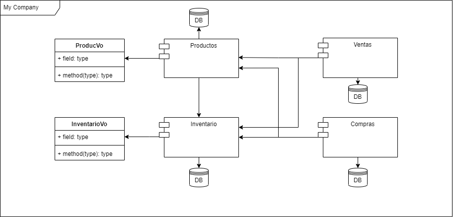
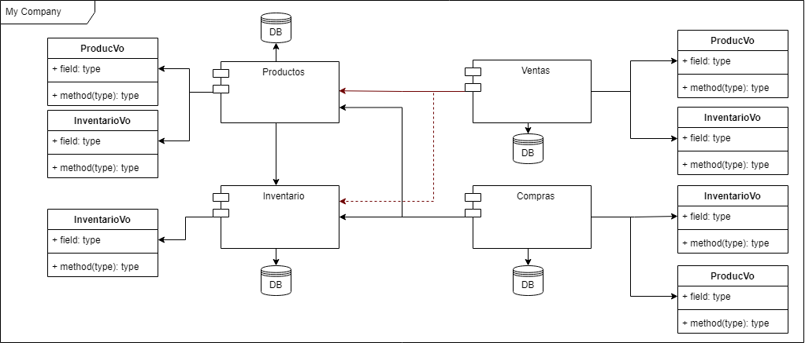
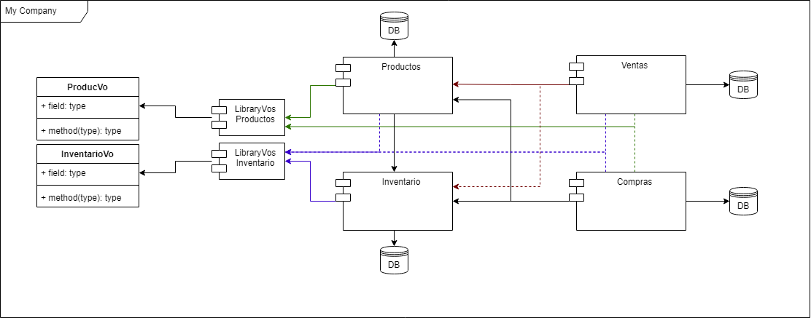
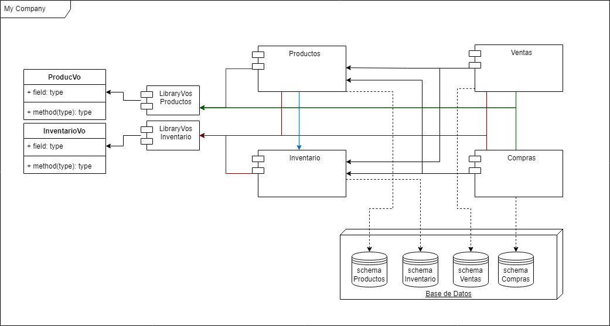

# Maven Archetypes
Este repositorio contiene diferentes arquetipos de **maven**, creados siguiendo la [guía oficial](https://maven.apache.org/guides/mini/guide-creating-archetypes.html). Los cuales se utilizan en escenarios según el tipo de proyecto que se desea crear. en el apartado [Diagrama](#diagrama-para-el-usuo-de-cada-archetype) se brinda la guia de cual arquetipo se debe utilizar según el tipo de proyecto.

 

# Diagrama para el usuo de cada Archetype
Se plantea el escenario de la [Imagen 1](#imagen-1), ahora bien, se puede identificar que las clases **ProductVo** e **InventarioVo** pertenecen a sus respectivos micro servicios. 

Los micro servicios **Compras** y **Ventas** deben consumir los micro servicios **Productos** e **Inventario**, para lo cual deben enviar un **ProductVo** e **InventarioVo**. 

### Imagen 1

 

### ¿Cuál es el mejor escenario para el intercambio de los **VOs**? 

1. Se realiza una copia de los **VOs** en cada micro servicio, **Compras** y **Ventas**.
    
    Podemos notar que tenemos los **VOs** por todos los microservicios, si ahora nos piden agregar un nuevo campo a **InventarioVo**, esto demanda un trabajo en cada micro-servicio.

     

2. Se crea una `librería` para cada micro servicio, **Productos** e **Inventario** que contenga los **VOs** correspondiente y se reutiliza en los micro servicios **Compras** y **Ventas**.
    

     

3. Que otras opciones conoces?

 

## Diagrama final
Para completar el diagrama se plantea unificar la bases de datos y facilitar a cada microservicio un schema independiente, esto solo es un planteamiento ya que cada opción conlleva **ventajas** y **desventajas** tanto a nivel de rendimiento, desarrollo y costo económico.

 

 

# Conclusión
Una vez planteado los diferentes escenarios con los respectivos diagramas, ahora podemos tener una idea de cual arquetipo utilizar según el tipo de microservicio a crear. 

En el caso de que el microservicio sea del tipo de **Ventas** y/o **Compras** el cual no será consultado por otros microservicios, se utilizaría el arquetipo [mave-archetype-microservice](maven-archetype-microservice/)  debido a que los **VOs** no serán compartidos. 

En el caso de que el microservicio sea del tipo **Productos** y/o **Inventario** los cuales son consultados por otros microservicios, se utilizaría el arquetipo [maven-archetype-microservice-modules](maven-archetype-microservice-modules/) el cual genera un proyecto con dos módulos **Api** y **Library** con la finalidad de que el módulo **Library** el cual contiene los **VOs** pueda ser compartido.

Todo lo anterior se plantea después de trabajar en varios proyectos y ver las diferentes formas en la que en cada empresa plantean diferentes soluciones al mismo problema, he trabajado con diferentes equipos los que utilizan la solución del punto 1 y los que utilizan la solución del punto 2, la solución del punto 2 me la planteo un compañero al cual le debo dar el crédito ya que la verdad esta solución me gustó mucho, por tal motivo la implemento desde entonces, pero es necesario tener la información idónea antes de iniciar a trabajar en un microservicio y poder identificar con cuál de los dos escenarios nos vamos a enfrentar.

 

## Bonus
Si has llegado a este punto sin iniciar la configuración, ya sea porque no has entendido o porque primero lees, te comparto el link de mi lista en youtube [Maven Archetypes](https://youtube.com/playlist?list=PLkZ7fyf7voZC6qDVJGeDFiSclXa0ueMBW) en el cual se realizan todos los pasos de la documentación y se explica la idea en detalle y con proyectos de ejemplo. 

 

# Fecha y Descripción de Cambios
1. `11 de agosto de 2022`, Se crea el arquetipo [mave-archetype-microservice](maven-archetype-microservice/) y se crea la documentación inicial del `README`.

 

2. `12 de agosto de 2022`
    * Se crea el arquetipo [maven-archetype-microservice-modules](maven-archetype-microservice-modules/)
    * Se copia toda la documentación del `README` creada en la fecha del `punto 1` al `README` del arquetipo [mave-archetype-microservice](maven-archetype-microservice/).

 

3. `19 de agosto de 2022`
    * Se implementa la libreria de [Swagger OpenApi](https://springdoc.org/) la cual nos permite documentar los controladores y endpoints.
    * Se agrega un ejemplo de como se suguiere aplicar la documentación en **Swagger OpenApi** en el paquete controller de cada arquetipo.

 

4. `22 de agosto de 2022`
    * Se agregan nuevos diagramas y documentación al `README`.

 

5. `19 de octubre de 2022`
    * Se implementa el `.gitignore` en los archetypes para que se vean reflejado en los proyectos.
