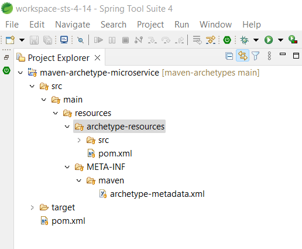

# Maven Archetypes Microservice
Este arquetipo nos permite generar proyectos iguales al **Archetype de Spring Boot**, con unas mejoras, las cuales incluye los paquetes que siempre se generar de forma manual, ahora se crean por defecto al igual que algunas clases sugeridas que contendrá el microservicio. 

<br>

# Descripción del Archetype
1. Se debe clonar el proyecto a tu espacio de trabajo.

    ```git
    git clone https://github.com/robinarehen/maven-archetypes.git
    ```

<br>

2. El proyecto es importado al entorno de **STS**, este es un paso opcional para poder visualizar mejor la estructura del **Archetype** y no hacer el proceso de compilación por la consola de comandos.

    ### Imagen 1 
    

    Como se evidencia en la [Imagen 1](#imagen-1), el arquetipo contiene el `pom-xml` y la ruta raiz `~/src/main/reources` donde dentro de la última carpeta `resources` se crea todo lo relacionado a nuestro arquetipo. 

<br>

3. El `pom.xml` de la [Imagen 2](#imagen-2), contiene la versión de la extensión `maven` a la fecha `11/08/2022` por lo cual se debe ingresar a la [guía oficial](https://maven.apache.org/guides/mini/guide-creating-archetypes.html) y confirmar la versión más reciente. Tambien se puede confirmar la versión más reciente desde [Mave Central](https://mvnrepository.com/artifact/org.apache.maven.archetype/archetype-packaging), porque en ocasiones tardan en actualizar la documetación.

    ### Imagen 2
    

    Del `pom.xml` se debe actualizar la versión de `maven` en la línea `17` siempre que haya cambiado, adicionalmente se debe cambiar el valor del `groupId` línea `7` por el paquete de la organización y opcionalmente se puede cambiar el valor del `artifactId` por el valor que se crea conveniente.

    ## NOTA
    Si se cambia el valor del `artifactId` en el `pom.xml` es necesario cambiarlo en el archivo `archetype-metadata.xml`, el cual se visualiza en la [Imagen 1](#imagen-1) en la ruta `~/src/main/reources/META-INF/maven` y se debe cambiar la propiedad `name="maven-archetype-microservice"` en la línea `5`, ver [Imagen 3](#imagen-3).

<br>

4. El siguiente paso es describir el archivo `archetype-metadata.xml` el cual su ruta raíz es `~/src/main/reources/META-INF/maven` y no debe ser movido a otro lugar, ver [Imagen 1](#imagen-1), en la [guía oficial](https://maven.apache.org/archetype/archetype-models/archetype-descriptor/archetype-descriptor.html) se describen los valores que puede contener, en este archivo es donde se describe toda la información que el arquetipo va a gestionar. 

    ### Imagen 3
    

    Como se muestra en la [Imagen 3]() en este archivo se describen las carpetas que va a contener nuestro proyecto y se activa la propiedad ` packaged="true"` a las carpetas que serán un paquete en donde se almacenarán todas nuestras clases y las carpetas normales para almacenar los archivos adicionales.

    En la líneas de la `7 - 9` se define la propiedad obligatoria con `key="project-name"` la cual se solicita al momento de crear el proyecto.
    ```xml
	<requiredProperties>
		<requiredProperty key="project-name"></requiredProperty>
	</requiredProperties>
    ```

<br>

5. Para finalizar se muestra en la [Imagen 4](#imagen-4) el contenido de la carpeta `~/src/main/reources/archetype-resources` la cual contiene toda la definición del proyecto a crear, el `pom.xml` con todas las dependencias a agregar por defecto, la ruta de los paquetes  `~/main/java` y `~/test/java`, al momento de generar el proyecto con el nuevo arquetipo, dentro de `~/java` se autocompleta la estructura de paquetes, lo cual veremos más adelante. 

    ### Imagen 4
    

    Al abrir el `pom.xml` en la ruta `~/src/main/reources/archetype-resources/pom.xml` vamos a notar que tiene la siguiente configuración, la cual se autocompleta cuando creamos el proyecto.

    ```xml 

    <groupId>${groupId}</groupId> 
    <artifactId>${artifactId}</artifactId> 
    <version>${version}</version> 

    ```` 
<br>

# Configuración del Archetype en Eclipse STS

1. Pasamos a compilar e instalar el nuevo arquetipo, donde debemos dar clic derecho sobre el proyecto y ejecutar las opciones `Run As -> Maven clean` y `Run As -> Maven install` ver [Imagen 5](#imagen-5).

    ### Imagen 5
    

    Una vez ejecutado el comando `Maven install` si no tenemos problemas, el resultado debe ser como se muestran en la [Imagen 6](#imagen-6)

    ### Imagen 6
    

<br>

2. En este paso se debe entrar al menu `File -> New -> Project...` y buscamos la carpeta `Maven -> Maven Project`, donde debes dar `Next` como se muestra en las imagenes de la `7` hasta llegar a la imagen `9`.

    ### Imagen 7
    

    ### Imagen 8
    

    <br>

    ## Nota

    En la [Imagen 9](#imagen-9) debemos seleccionar el `catalog => Default Local` y activar el check `Include snapshost archetype`.
    
    Es normal que no se muestre nuestro arquetipo la primera vez, por tal motivo debemos dar clic en el botón `Add Archetype` y agrega la información que nos solicitan, como se muestra en la [Imagen 10](#imagen-10), la cual es la que hemos configurado en el `pom.xml` de la carpeta raíz. 

    ### Imagen 9
    

    ### Imagen 10
    

    Una vez damos `Ok`, se nos muestra nuestro arquetipo como se muestra en la [Imagen 9](#imagen-9), lo seleccionamos, damos `Next` y vemos la última ventana donde debemos colocar la información que nos solicita, como se puede ver en la [Imagen 11](#imagen-11)

    ## Imagen 11
    

    
    * **groupId:** Paquete en el cual se organiza el proyecto en la carpeta raíz de `maven` en la ruta `C:\Users\your-user\.m2\repository`. 

    * **artifactId:** nombre del proyecto el cual se recomienda en letras **minúsculas** y separado por guiones, en el caso que el nombre del proyecto sea compuesto por dos o más palabras.

    * **package:** Paquete que se muestra en **Eclipse STS** como organización de nuestro proyecto, se recomienda que el nombre de los paquetes sea en letras **minúsculas** y sin ningún tipo de separador.

    * **project-name:** Nombre de la clase que tomaran las clases por defecto del proyecto, incluyendo la clase inicial de `Spring Boot`, se recomienda que el nombre inicie con **mayúsculas** y en el caso que el nombre sea compuesto por dos o más palabras, la siguiente palabra también debe iniciar en **mayúsculas**, ejemplo: `MyClassName`. Todo lo anterior basado en la nomenclatura [Upper Camel Case](https://es.wikipedia.org/wiki/Camel_case).

<br>

3. Resultado final de como se genera el nuevo proyecto con el arquetipo.

    ## Imagen 12
    


## Bonus
Si has llegado a este punto sin iniciar la configuración, ya sea porque no has entendido o porque primero lees, te comparto el link del video en youtube [Maven Archetypes](https://youtu.be/ogh2YQht-aQ) en el cual se realizan todos los pasos de la documentación, como en el libro **Álgebra de Baldor**, que después de tanto sufrir con los ejercicios, nos damos cuenta que las respuestas están al final.
